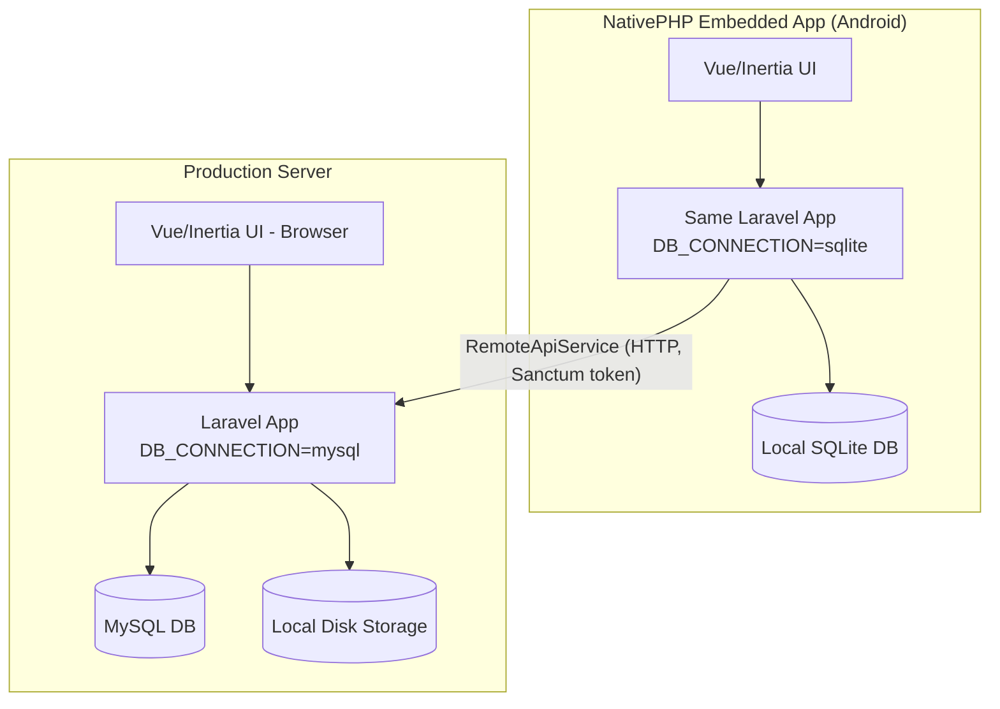
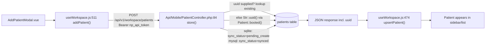
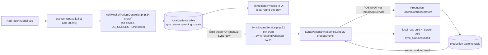
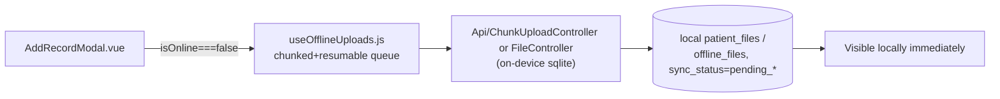
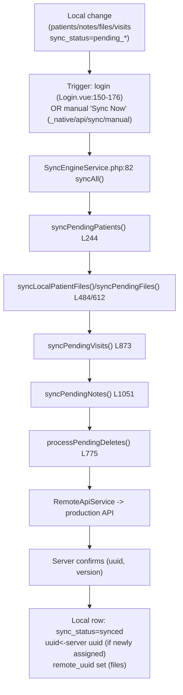
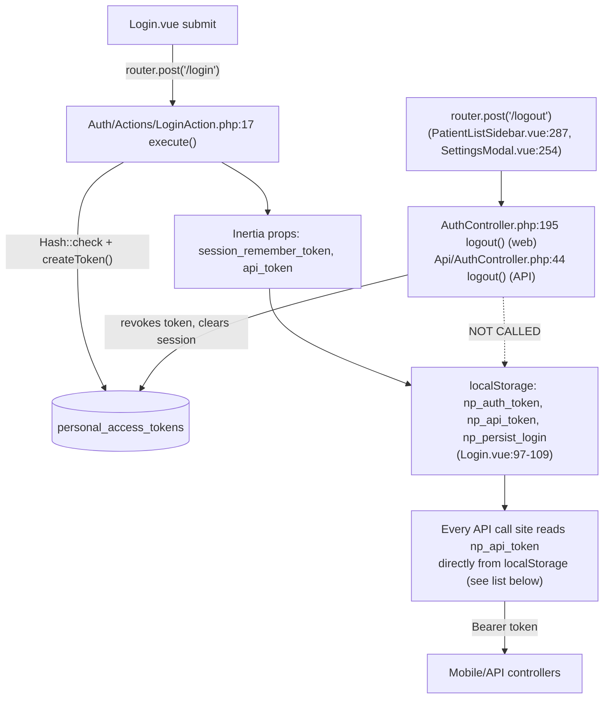

# Medical Plus v4 — Architecture Analysis (Pre-Rewrite Reverse Engineering)

Code-only analysis. No application source was modified to produce this document. All claims are backed by a file reference; anything not directly evidenced in source is marked `NOT PROVABLE FROM SOURCE`.

---

## 1. Executive Summary

This is **one Laravel 11 + Vue 3 (Inertia) codebase** that runs in two modes selected purely by `DB_CONNECTION`:

- **Server/production**: `mysql`, Sanctum bearer-token auth, multi-doctor data isolation (`DoctorIsolationScope`).
- **Embedded mobile app (NativePHP/Android)**: `sqlite`, runs the *same* Laravel app on-device, unauthenticated locally (single on-device user), acting as an offline-first local store that pushes/pulls to production over HTTP via `RemoteApiService`.

There is no separate "offline client" implementation — controllers, models, and migrations are shared, and nearly every write path branches on `config('database.default') === 'sqlite'` to decide "am I the offline device or the server." Patients, notes, and files created offline get a `sync_status` of `pending_*` and are queued for push; UUIDs are always server-generated (by whichever Laravel instance — device or production — handled the write) and used as the idempotency key for patients; files never accept a client UUID. A `SyncEngineService` (actively used) and an older, partially-overlapping `app/Services/Sync/*` queue-based implementation both exist side by side. Auth token state (`localStorage`) is never cleared on logout, which is the proven root cause of the "logout requires cache clearing" symptom.

---

## 2. System Architecture



- Backend: Laravel 11, domain-oriented structure under `app/Domains/{Patients,Media,Sync,Users,Auth,ActivityLogs}`, plus `app/Services`, `app/Repositories`, `app/Http/Controllers/Api/{,Mobile}`.
- Frontend: Vue 3 + **Inertia.js** (not a pure SPA, no Pinia/Vuex) — server-driven page props plus module-scope singleton composables acting as de-facto stores (`resources/js/Composables/*`).
- Mobile: NativePHP wraps the same Laravel app in an Android WebView; native Kotlin layer (`nativephp/android/...`) is a build artifact, out of scope per instructions.
- DB: shared migration set (`database/migrations/`) applies to both `mysql` (server) and `sqlite` (device) connections — `config/database.php:35`.
- Auth: Laravel Sanctum (`personal_access_tokens` table) for API/bearer auth; Laravel session/cookie for web (Inertia) auth.

---

## 3. Repository / Module Map

| Area | Key paths |
|---|---|
| Patient domain | `app/Domains/Patients/Models/{Patient,PatientNote,PatientShare,PatientVisit}.php`, `Services/{PatientService,ShareService}.php`, `Resources/PatientResource.php` |
| Media/file domain | `app/Domains/Media/Models/{PatientFile,FileCategory,UploadSession}.php`, `Services/UploadService.php`, `Jobs/{GenerateThumbnailJob,OptimizeVideoForStreaming}.php` |
| Sync domain | `app/Domains/Sync/Models/SyncQueue.php`, `Services/SyncQueueService.php` |
| Sync engine (active) | `app/Services/SyncEngineService.php`, `app/Services/ManualSyncService.php`, `app/Services/OfflineUploadService.php` |
| Sync per-entity (legacy/partial) | `app/Services/Sync/{PatientSyncService,FileSyncService,NoteSyncService,VisitSyncService,CategorySyncService,DownloadSyncService,ConflictResolverService,CacheCleanupService}.php` |
| Mobile API client | `app/Services/Mobile/{ApiService,RemoteApiService,PatientRepository,NoteRepository,VisitRepository,FileCacheService}.php` |
| Repositories | `app/Repositories/{PatientRepository,CategoryRepository,OfflineFileRepository,FileCacheRepository}.php`, `app/Repositories/Eloquent/*`, contracts in `app/Contracts/Repositories/*` |
| Controllers (web/Inertia) | `app/Http/Controllers/{PatientController,AuthController,DashboardController,SettingsController,WorkspaceController}.php` |
| Controllers (API) | `app/Http/Controllers/Api/{AuthController,ChunkUploadController,FileAccessController,CategoryController,VisitController,NoteController,PatientShareController}.php` |
| Controllers (Mobile API) | `app/Http/Controllers/Api/Mobile/{Patient,Visit,Note,File,Dashboard,Doctor,Share,Search,Bootstrap}Controller.php` |
| Vue composables (state hub) | `resources/js/Composables/{useWorkspace,useUploads,useOfflineUploads,useSyncEngine,useNativeBridge}.js` |
| Vue pages/components | `resources/js/Pages/{DoctorWorkspace,Auth/Login,PatientPrint}.vue`, `resources/js/Components/workspace/{AddPatientModal,AddRecordModal,PatientListSidebar,SyncCenterModal,SettingsModal}.vue` |
| Migrations of note | `database/migrations/2026_06_29_144924_create_patients_table.php`, `..._144925_create_patient_files_table.php`, `..._144926_create_offline_sync_tables.php`, `2026_07_23_*` (sync_status/file_cache/offline_files/cached_categories), `2026_08_02_000001_enhance_sync_queue_and_versioning.php` |

---

## 4. Patient Lifecycle

### Online / normal creation (device-to-device-Laravel, always — see note)



**Important nuance**: `AddPatientModal.vue` always POSTs to `/api/v1/workspace/patients`, which (per the plan's key architectural fact) is served by *whichever Laravel instance is running* — the on-device SQLite instance when running as the embedded mobile app, or the production MySQL instance when running as the website. There is no separate "online path vs. offline path" branch in the create UI itself; the branching happens **inside** `PatientController@store` based on `config('database.default')`.

- ID/UUID: canonical UUID is **server-generated** — `Patient.php:31` `booted(){ static::creating(fn($p) => $p->uuid ??= Str::uuid()) }`. Client MAY pass a `uuid` in the request; `PatientController.php:84 store()` treats an existing matching `uuid` as an idempotency key — look up, and if found, `update()` + return 200 instead of creating a duplicate; a `QueryException` (unique constraint violation) is also caught as a race-condition fallback (`PatientController.php:~265-276`).
- `sync_status`: set to `pending_create` when the write happens on the SQLite (device) connection, `synced` when on MySQL (`PatientController.php:84`, per branch documented by the backend map).
- The frontend receives the created patient (including its canonical `uuid`) synchronously in the HTTP response and calls `useWorkspace.js:474 upsertPatient()` to place it into the reactive `patients` list — this is why it "appears immediately," with no separate polling/refetch step.

### Offline creation → local SQLite → pending → sync → server

Because the device *is* a full Laravel+SQLite instance, "offline creation" is not a fundamentally different code path from the above — it is the same `PatientController@store` running against `sqlite`, which is what sets `sync_status='pending_create'`.



Offline-specific facts:

- Exact table: `patients` (same table/schema as server — no separate "local_patients" table exists).
- Relevant columns: `uuid`, `sync_status` (`synced`/`pending_create`/`pending_update`/`pending_delete`), `version`, `server_updated_at`, `client_updated_at` (added `2026_08_02_000001_enhance_sync_queue_and_versioning.php`).
- The local record and the eventual server record are **the same row content**, reconciled by `uuid` — not two different representations. The only thing that changes post-sync is `sync_status` and (if the client didn't supply a uuid) the `uuid` value itself gets confirmed/overwritten with the server-issued one.
- "How the app knows the record is pending": `sync_status != 'synced'` on the row; surfaced to the UI via `useWorkspace.js:94` (`patients.value.filter(p => p.sync_status && p.sync_status !== 'synced')`).
- What happens when internet becomes available: nothing automatic. `useSyncEngine.js` explicitly comments that its `online`/`offline` window-event listeners are "purely for UI status icon" and do **not** auto-trigger sync. Sync only runs on explicit "Sync Now" (`SyncCenterModal.vue` → `_native/api/sync/manual`) or automatically once, fire-and-forget, right after a successful login (`Login.vue:150-176`).
- How local patient becomes associated with the server patient: purely via the shared `uuid` column — `Sync/PatientSyncService.php:20 processItem()` pushes and, on success, writes the server's returned `uuid` back onto the local row and flips `sync_status` to `synced`.

---

## 5. Patient Display / Identity Mapping

Patient name is rendered **unguarded** everywhere in the Vue layer — no client-side fallback template exists:

- `Components/workspace/PatientListSidebar.vue:74` — `{{ patient.name }}`
- `Components/workspace/PatientSummary.vue:10`, `SharePatientModal.vue:126` (`patient?.name || ''`), `EditPatientModal.vue:64` (`p.name || ''`)
- `Pages/PatientPrint.vue:12,21`, `Pages/Admin/Doctors/Show.vue:109-111,164`
- `PatientResource.php` (`app/Domains/Patients/Resources/PatientResource.php`) also passes `name` through untouched — no server-side default in the API resource layer either.

### Root cause of `Patient XXXXX`

The literal string is produced in exactly one place: **`app/Http/Controllers/Api/ChunkUploadController.php:508`**, inside `resolvePatient()` (private method, `:459`), called from `init()` (`:72`, the chunked-file-upload initialization endpoint).

```
'name' => 'Patient ' . $uuid,   // ChunkUploadController.php:508
```

Flow that triggers it:

1. `init()` (`ChunkUploadController.php:31`) is called to start a chunked file upload for a given `patient_id`.
2. It calls `resolvePatient($request->patient_id)` (`:72`).
3. `resolvePatient()` first looks for an existing local `Patient` row by numeric id, `uuid`, or `remote_uuid` (`:478-485`). If found, it's returned as-is (no bug).
4. If **not found**, and only when running on the embedded device (`config('database.default') === 'sqlite'`, gated at `:493` — production returns a 404 instead), it fabricates a **stub patient row**: `uuid` = the requested id (or a fresh one), `sync_status = 'pending_create'`, `name = 'Patient ' . $uuid` (`:497-509`).
5. This stub is a real row in the local `patients` table. It renders as `Patient <uuid>` anywhere the UI displays that patient, until/unless it is later overwritten with real data.

**When this race actually happens**: a chunked file upload is initiated referencing a `patient_id` that the device's local `patients` table doesn't yet contain — e.g., a file attached to a patient the device hasn't synced/downloaded yet, or (per the large comment block at `:470-476`, which documents a *related*, already-fixed bug) any sequencing where file upload starts before the owning patient's own create request has committed locally. That earlier fix ensured an *existing* patient is never overwritten by stub data (protecting `sync_status`), but it did not remove the stub-creation branch itself — so the display defect (`Patient XXXXX`) still occurs whenever this race is the *first* thing to create the row.

Confidence: **High** — directly evidenced by the literal string, its call path, and the SQLite-only gating condition.

---

## 6. File Lifecycle

### Storage locations (three, unified at read time)

`app/Http/Controllers/Api/FileAccessController.php:38 resolveAbsolutePath()` is the single place that reconciles all three; its own docblock (`:29-37`) documents that before this method existed, a file present in one location was reported missing by code that only checked another (most visibly thumbnails, previously 204 for every website-downloaded file).

| Location | Backing store | Metadata table |
|---|---|---|
| Normal uploaded/synced file bytes | `local` disk, `patient_files.file_path` | `patient_files` |
| File cached down from production for offline viewing | path resolved via `FileCacheService`/`file_cache` table | `file_cache` (`file_uuid`, `patient_uuid`, `local_path`, `checksum`) |
| File created offline, pending push | path resolved via `OfflineUploadService` | `offline_files` (`uuid`, `patient_uuid`, `local_path`, `sync_status` default `pending_upload`, `remote_uuid`, `retry_count`) |

### Online file creation

```mermaid
flowchart LR
    UI[AddRecordModal.vue] -->|"isOnline===true"| Up["useUploads.js chunked engine"]
    Up -->|"chunk init/chunk/complete"| Ctrl["Api/ChunkUploadController.php\ninit()/chunk()/complete()"]
    Ctrl -->|"or simple path"| FC["Api/Mobile/FileController.php:88 store()"]
    FC -->|"Str::uuid() server-generated\nFileController.php:116"| Store["storeAs patients/{patientUuid}/{fileUuid}.ext\ndisk('local')"]
    Store --> DB[(patient_files table)]
    DB -->|"sqlite: sync_status=pending_sync\nmysql: sync_status=synced"| Resp[JSON response]
    Resp --> UI2[UploadManager.vue progress/complete]
```



### Offline file creation



### Upload after reconnect (sync push)

`app/Services/Sync/FileSyncService.php:26 processItem()`:
- Checks server-side sha256 dedup before re-uploading (`checkServerSha256Deduplication()`, `:141`) — prevents duplicate file bytes reaching production if the same file was somehow already pushed.
- Resumable large-file path: `uploadLargeFileResumable()` (`:158`).
- `patient_files.remote_uuid` tracks the server-assigned UUID separately from the local `uuid`; `remote_uuid IS NULL` is the signal "needs push."
- File **never** accepts a client-supplied UUID (unlike patients) — `FileController.php:116` always generates a fresh `Str::uuid()` server-side, on whichever Laravel instance handles the request.

For each mode:
- **Where physical bytes exist**: local disk (`storage/app/private/patients/{uuid}/...`) on whichever instance received the upload first; may additionally exist in `file_cache`/`offline_files`-tracked paths.
- **Where metadata exists**: `patient_files` row (canonical), optionally shadowed by `file_cache`/`offline_files` rows during the cache/offline-pending window.
- **Status/retry**: `sync_status` on `patient_files`; `retry_count`/`error_message` on `offline_files`.
- **Duplicate prevention**: sha256 check server-side (`FileSyncService.php:141`).
- **Relationship to patient**: `patient_files.patient_id` FK; storage path is namespaced by `patientUuid` (`FileController.php:154-158`).

---

## 7. File Download / Local Access

`PatientFile::getUrlAttribute()` (`app/Domains/Media/Models/PatientFile.php`) is the decision point for remote-vs-local:

- If `config('database.default') === 'sqlite'` (embedded device) **and** the file is not yet `synced`: URL points at `/_native/cache/files/{uuid}` (device-local cache route).
- Otherwise (synced, or running on production): URL redirects to production `GET /api/v1/files/{remote_uuid ?: uuid}`.

Serving endpoints in `FileAccessController.php`:
- `streamDirect()` (`:291`) / `thumbnailDirect()` (`:303`) — authenticated production reads, support HTTP Range (206) for video seeking via `BinaryFileResponse` (comment at `:82-85` explains this is why real file responses are used instead of hand-echoed bytes).
- `streamCached()` / `streamCachedBase64()` / `cacheFile()` / `cacheStatus()` / `removeCached()` / `removePatientCached()` (`:527-755`) — device-local cache read/populate/evict, exposed under `_native/cache/*` routes.
- `DEVICE_MAX_CHUNK_BYTES` (`:79`, 2 MiB) caps every response the embedded device serves through this controller, regardless of what the client asked for (`rangeCappedResponse()`, `:141`).
- Auth: production `streamDirect`/`thumbnailDirect` sit behind Sanctum (per the `auth:sanctum` conditional middleware documented in the backend map); the embedded device's own `_native/cache/*` routes run unauthenticated locally (single on-device user, per the sqlite-bypass pattern).
- Automatic download: `Login.vue` fires `/_native/api/sync/manual` after login, which per `SyncEngineService` pulls patient/note/visit data down — `NOT PROVABLE FROM SOURCE` whether file *bytes* (vs. metadata) are proactively downloaded at login, versus lazily cached on first view via `cacheFile()`. The presence of an explicit `cacheFile()`/`cacheStatus()` pair strongly suggests **on-demand caching**, not bulk prefetch, but this is inferred from API shape rather than directly proven by a caller trace within token budget.
- Offline: if a file was never cached (`file_cache`/`offline_files` has no matching row) and the device is offline, `resolveAbsolutePath()` (`FileAccessController.php:38`) returns `null` and the endpoint would 404/204 — no fallback content is generated.

---

## 8. Synchronization Architecture

### Two overlapping implementations

- **Active engine**: `app/Services/SyncEngineService.php` (~1400 lines). Entry point `syncAll()` (`:82`), which per a "SYNC-005 FIX" comment in `routes/web.php:342-346` explicitly **supersedes** the older per-entity/queue design for the main pipeline.
- **Legacy/partial**: `app/Domains/Sync/Services/SyncQueueService.php` (backs the `sync_queue` table) + `app/Services/Sync/{PatientSyncService,NoteSyncService,FileSyncService,VisitSyncService,CategorySyncService,DownloadSyncService,ConflictResolverService,CacheCleanupService}.php`. These per-entity `processItem()` classes are still invoked for parts of the pipeline (file sha256 dedup, resumable upload logic) — i.e., **not fully dead**, but overlapping in responsibility with `SyncEngineService`. This dual implementation is a proven architectural risk (see §13).

### Flow



- **Ordering/dependency**: patients are synced before files/notes/visits (call order inside `syncAll()`), which is required because files/notes carry a `patient_id`/`patient_uuid` FK. This ordering is enforced by **method call sequence, not an explicit dependency graph** — a proven risk if any step reorders in a rewrite.
- **Idempotency**: patients — client/local `uuid` uniqueness + existing-row lookup + unique-constraint-violation catch (`PatientController.php:~265-276`). Files — sha256 dedup server-side (`FileSyncService.php:141`). Both rely on the shared `patients`/`patient_files` tables being the same schema on both ends.
- **Conflict handling**: `version`/`server_updated_at`/`client_updated_at` columns (migration `2026_08_02_000001`) feed `ConflictResolverService::resolve()` (`app/Services/Sync/ConflictResolverService.php:12`) — a pure function: `both modified at same version → 'conflict'`; `server newer → 'download'`; `local newer → 'upload'`; equal & local modified → `'upload'`, else `'download'`. **What consumes the `'conflict'` return value and how it's surfaced to the user**: `NOT PROVABLE FROM SOURCE` within the scope of this analysis — only the resolver function itself was located; no caller applying its `'conflict'` branch was found.
- **Partial failure / app restart**: each pending record's `sync_status` is durable in the DB, so a partial sync leaves exactly the un-synced records marked pending; a restart simply re-evaluates `sync_status` on the next trigger. No explicit "resume from checkpoint" logic beyond this durable per-row status was found.
- **Sync running twice / concurrently**: `NOT PROVABLE FROM SOURCE` — no mutex/lock construct (e.g., cache lock, `DB::transaction` isolation guard, or a "sync in progress" flag) was located in `SyncEngineService.php` during this analysis; the `_native/api/sync/state` polling endpoint (routes/web.php) suggests some notion of in-progress state exists at the route layer, but the concurrency-safety of two overlapping `syncAll()` invocations could not be confirmed from source within the review scope.
- **Dead tables** (created via migration, zero references found in `app/`): `pending_operations`, `sync_meta`, `sync_states`, `sync_jobs` — legacy artifacts, not part of live behavior.

---

## 9. Sync Triggering

| Trigger | Entry point | Notes |
|---|---|---|
| Manual "Sync Now" | `SyncCenterModal.vue` → `POST _native/api/sync/manual` → `SyncEngineService::syncAll()` | User-initiated, polled via `GET _native/api/sync/state` every 2s |
| Login | `Login.vue:150-176`, fire-and-forget `fetch('/_native/api/sync/manual', ...)` after `router.post('/login')` succeeds | Non-fatal on failure (comment: "will retry later"); also primes `/_native/api/bootstrap/refresh` (categories/user/visit-types) first |
| App startup | `NOT PROVABLE FROM SOURCE` — no scheduler/boot hook found that auto-triggers sync on cold start beyond the login flow above |
| Network reconnect | **Explicitly not wired** — `useSyncEngine.js` comments its `online`/`offline` listeners are "purely for UI status icon," not a sync trigger |
| Background/periodic | **None** — `app/Console/Kernel.php` schedule is empty (comment: "No scheduled tasks yet") |

Whether multiple sync executions can run simultaneously: `NOT PROVABLE FROM SOURCE` (see §8 concurrency note).

---

## 10. Authentication + Logout



- **Token storage locations**: Sanctum `personal_access_tokens` table (server truth) + PHP session + `localStorage['np_auth_token']`, `localStorage['np_api_token']`, `localStorage['np_persist_login']` (device-side copies). No sessionStorage or SQLite-stored token was found.
- **App-restart session restore**: `routes/web.php:15 POST /api/session/restore` — frontend sends the persisted `api_token`; server calls `Auth::login()` to restore the session without re-prompting credentials (comment at `:54-57`).
- **Login**: `Login.vue:97-176` `onSuccess` handler pulls `page.props.session_remember_token` → `np_auth_token`/`np_persist_login`, and `page.props.api_token` → `np_api_token`; then fire-and-forget primes `/_native/api/bootstrap/refresh` and `/_native/api/sync/manual`.
- **Logout call sites**: `PatientListSidebar.vue:287 handleLogout()` and `SettingsModal.vue:254 logout()` — both call **only** `router.post('/logout')`.
- **Server-side logout**: `AuthController.php:195 logout()` (web) and `Api\AuthController.php:44 logout()` (API/Sanctum) revoke the current access token and clear the PHP session.
- **Root cause of "logout requires cache clearing"**: a repo-wide grep for `localStorage.removeItem`/`localStorage.clear` across `resources/js/**` returns **zero matches**. Nothing ever removes `np_auth_token`/`np_api_token`/`np_persist_login` from `localStorage`. Every subsequent request-building call site independently re-reads `np_api_token` straight from `localStorage` and attaches it as the Bearer header: `Utils/api.js:67`, `useWorkspace.js:537,597`, `useSyncEngine.js:90,150`, `useUploads.js:77`, `useOfflineUploads.js:99`, `AddRecordModal.vue:202`, `AppLayout.vue:241`. So after logout, a stale (now server-revoked) token remains in `localStorage` and keeps being sent — manually clearing app storage is the only way to remove it. Confidence: **High**.
- **AUTHENTICATION STATE vs. LOCAL APPLICATION DATA**:
  - Authentication state = Sanctum token row (server) + PHP session + the three `localStorage` keys above.
  - Local application data = all SQLite domain tables (`patients`, `patient_notes`, `patient_files`, `offline_files`, `file_cache`, `sync_queue`, `cached_categories`, etc).
  - These are **not** incorrectly coupled to each other in the sense of "app data leaking into auth logic" — the actual defect is narrower: auth state itself is only *partially* cleared on logout (session+token revoked server-side, but the client-side token cache is not). Local application data is untouched by logout in both controllers, which is a separate, deliberate-looking design choice (offline data survives logout) but has a side effect: on a shared device, a previous doctor's cached patient data remains readable locally after a different doctor logs in, since nothing scopes/clears local SQLite rows per-user.

---

## 11. Local Database Lifecycle

- **Location**: fixed path under app-private storage, e.g. `/data/data/com.medicalplus.app/app_storage/persisted_data/database/medical_plus.sqlite`, set via `.env.native*` (`DB_CONNECTION=sqlite`, `DB_DATABASE=...`).
- **Migrations**: one shared `database/migrations/` directory serves both `mysql` (server) and `sqlite` (device) connections (`config/database.php:35`); no separate offline-only migration set exists.
- **Initialization/startup behavior**: `NOT PROVABLE FROM SOURCE` from the PHP/Vue layer alone — whether migrations auto-run on every device boot, or the SQLite file is created once and persisted, is governed by the NativePHP/Kotlin native lifecycle, which is a build artifact excluded from this review per instructions.
- **Persistence across app restart**: the DB path is under persistent app storage (not a temp/cache directory per the `.env.native*` path), implying it survives normal app restarts; this is inferred from the path naming, not from an explicit "on restart, reuse existing DB" code path found in PHP/Vue.
- **Logout behavior**: confirmed local tables are untouched by logout (§10) — no truncation/reset of any SQLite table occurs.
- **Cleanup**: `CacheCleanupService::cleanupBinaryCache()` (`app/Services/Sync/CacheCleanupService.php:24`) is retention/time-based (not logout- or restart-triggered) — the only found mechanism that ever prunes locally cached binary files.
- **What could accidentally delete/recreate local data**: `NOT PROVABLE FROM SOURCE` beyond the native app-storage lifecycle (e.g., Android "clear app data") — no in-app code path was found that deletes the SQLite file or truncates its domain tables.

---

## 12. Data Ownership Matrix

| Entity | Local DB (SQLite) | Server DB (MySQL) | Source of Truth | Sync State | Identifier |
|---|---|---|---|---|---|
| Patient | `patients`, full row | `patients`, full row | Server once synced; local authoritative until then | `patients.sync_status` | `uuid` (client-or-server generated; server enforces uniqueness) |
| Note | `patient_notes` | `patient_notes` | Same pattern as Patient | `patient_notes.sync_status` | `uuid`, server-generated |
| File | `patient_files` + `offline_files` + `file_cache` (bytes may live in any) | `patient_files` + disk storage | Server once synced; bytes may be local-only pre-sync | `patient_files.sync_status` / `offline_files.sync_status` | `uuid` (server-generated only) + `remote_uuid` (post-sync) |
| Category | `cached_categories` (read cache) | `file_categories` (canonical) | Server (reference data, pulled down, not created on-device) | n/a (cache, refreshed via bootstrap) | server `id` |
| Authentication | `localStorage` tokens + PHP session (device) | `personal_access_tokens` (Sanctum) | Server token row authoritative; device-side copy can go stale (§10) | n/a | Sanctum token string |

---

## 13. Current Bugs Explained From Source

### 13.1 Patient sometimes displays `Patient XXXXX`

- **Root cause**: `app/Http/Controllers/Api/ChunkUploadController.php:459 resolvePatient()`, line `:508`, fabricates a stub `Patient` row named `'Patient ' . $uuid` when a chunked file upload's `init()` (`:31`, `:72`) references a `patient_id` not yet present locally, gated to the embedded SQLite device only (`:493`).
- **Data flow**: `AddRecordModal.vue` upload → `ChunkUploadController::init()` → `resolvePatient()` → stub row inserted into local `patients` → rendered raw by any Vue component showing `patient.name` (e.g. `PatientListSidebar.vue:74`).
- **Affected state**: local `patients` table row with `sync_status='pending_create'` and a synthetic name.
- **Confidence**: High.

### 13.2 Sync sometimes does not complete

- **Root cause (proven contributors)**: (a) two overlapping sync implementations (`SyncEngineService` vs. `app/Services/Sync/*` + `SyncQueueService`) with the routes.php comment ("SYNC-005 FIX") itself documenting a prior instance of the *wrong* engine/status value causing files to "wait forever" (`ChunkUploadController.php:470-476` comment references this exact prior incident: a stub's `sync_status` was set to a value `SyncEngineService` never queries). (b) `ConflictResolverService::resolve()`'s `'conflict'` outcome has no located consumer — a record landing in that state has no confirmed resolution path. (c) sync ordering is by call sequence, not an enforced dependency graph, so partial failures mid-`syncAll()` could leave dependent records (e.g., a file for a patient that failed to sync) permanently pending.
- **Data flow**: `SyncEngineService::syncAll()` → per-entity `processItem()` → `RemoteApiService` → on any unhandled exception/version conflict, the row's `sync_status` simply never transitions to `synced`.
- **Confidence**: Medium — the failure *mechanisms* are proven from source; the frequency/exact trigger conditions in production are `NOT PROVABLE FROM SOURCE` without logs (excluded per instructions).

### 13.3 Logout requires cache clearing

- **Root cause**: `resources/js/**` never calls `localStorage.removeItem`/`localStorage.clear` for `np_auth_token`/`np_api_token`/`np_persist_login`. `PatientListSidebar.vue:287` and `SettingsModal.vue:254` both logout via `router.post('/logout')` only, which server-side (`AuthController.php:195`, `Api/AuthController.php:44`) revokes the Sanctum token and session — but never signals the client to drop its cached copy.
- **Data flow**: every subsequent request-building call site (`Utils/api.js:67` and 7 other sites listed in §10) re-reads the now-stale `np_api_token` from `localStorage` and keeps sending it as the Bearer token.
- **Affected state**: `localStorage` keys survive logout indefinitely; effectively a client-side token leak until manually cleared.
- **Confidence**: High — proven by exhaustive grep showing no removal call exists anywhere in the frontend.

---

## 14. Architectural Risks

Only risks directly evidenced by this codebase:

1. **Duplicated sync implementations** — `SyncEngineService` (active) and `app/Services/Sync/*` + `SyncQueueService`/`sync_queue` table (partially superseded, but still invoked for file dedup/resumable upload) overlap in responsibility. A rewrite must establish which is canonical before extending either (§8).
2. **Inconsistent ID/UUID acceptance rules** — patients accept a client-supplied `uuid` as an idempotency key (`PatientController.php`); files never do (`FileController.php:116` always server-generates). This asymmetry is undocumented in code and easy to violate accidentally in a rewrite.
3. **Auth state only partially cleared on logout** — `localStorage` token keys are never removed (§10, §13.3), the proven, direct cause of a real user-facing bug.
4. **No per-user scoping of local SQLite data on the embedded device** — logout never clears/reset local domain tables, so a shared device retains a previous doctor's patient data locally after a different doctor logs in (§10). `DoctorIsolationScope` protects the MySQL/server side but has no analogous enforcement for the on-device SQLite store, which the app treats as a single-user store.
5. **Stub-record creation as an error-recovery pattern** — `ChunkUploadController::resolvePatient()` silently invents placeholder domain data (`Patient XXXXX`) rather than rejecting or queuing the file upload until the parent patient exists locally. This pattern is itself a data-integrity risk beyond the display bug (a permanent placeholder row can end up synced to production).
6. **Sync ordering enforced by method call sequence, not a dependency graph** — patient-before-file/note/visit ordering inside `syncAll()` is implicit; a rewrite that parallelizes or reorders these calls could silently violate the FK dependency.
7. **Unresolved conflict path** — `ConflictResolverService::resolve()` computes a `'conflict'` verdict with no located caller acting on it; conflicting edits currently have no proven resolution UX or code path.
8. **Three-way file storage reconciliation logic concentrated in one method** (`FileAccessController::resolveAbsolutePath()`) whose own docblock documents it as a fix for previously-inconsistent behavior across `local` disk / `file_cache` / `offline_files` — a sign the underlying model (three places a file's bytes can live) is more complex than the domain model exposes, and easy to regress.
9. **Dead sync-related tables still present in migrations** (`pending_operations`, `sync_meta`, `sync_states`, `sync_jobs`) — indicates at least one earlier sync design was abandoned in place rather than removed; a rewrite should confirm nothing latent still depends on them before dropping them.
10. **No concurrency guard located for `syncAll()`** — no mutex/lock/in-progress flag was found in `SyncEngineService.php` protecting against two overlapping sync runs (e.g., user taps "Sync Now" twice, or login-triggered sync overlaps a manual one); `NOT PROVABLE FROM SOURCE` whether this is actually safe or unsafe, but the absence of a guard is itself notable given the shared-state read/writes involved.

---

## 15. Rewrite Considerations

What the new architecture must preserve, or explicitly decide to break with eyes open:

- **UUID contracts**: patients must continue to support a client-supplied `uuid` as an idempotency key if any existing offline-created-but-unsynced records are to reconcile correctly; files must keep server-only UUID generation unless every existing `offline_files`/`patient_files` row's assumptions are also migrated.
- **`sync_status` vocabulary**: `pending_create`/`pending_update`/`pending_delete`/`synced` (patients, notes, files, visits) — `SyncEngineService` queries these specific string values; any rewrite of the sync engine must either preserve them or migrate every existing row.
- **`remote_uuid` vs `uuid` distinction on files**: local identity and server identity are intentionally decoupled for files (not for patients/notes) — a rewrite must decide whether to keep this asymmetry or unify it, and either way must handle already-synced rows that only have `remote_uuid` set.
- **API compatibility surface**: `Api\Mobile\{Patient,File,Note,Visit}Controller` endpoints are called both by the embedded on-device Laravel instance (via `RemoteApiService`) and potentially by other real mobile clients — these contracts (request/response shape, status codes used for idempotent-create-vs-update) must remain compatible unless both server and every deployed device build are updated in lockstep.
- **Auth token handling must be fixed as part of, not incidental to, the rewrite**: logout must clear `np_auth_token`/`np_api_token`/`np_persist_login` from `localStorage`, and/or the token-attachment logic should be centralized (currently duplicated across 8+ call sites) so a single source of truth can be invalidated atomically.
- **Local data survives logout today (by omission, likely also by intent for offline availability)** — the rewrite should make an explicit decision: keep local data across logout for offline continuity (and then add proper per-doctor scoping/isolation on-device), or clear it (and accept re-download cost). The current implicit behavior (survives, unscoped) is a documented risk (§14.4), not a documented feature.
- **Sync ordering dependency (patient → file/note/visit)** must be preserved explicitly (e.g., via a real dependency graph or transaction) if the sync engine is redesigned, since it is currently implicit in call order.
- **Migration risk**: any schema change to `patients`/`patient_files`/`patient_notes`/`patient_visits` must account for the fact the exact same migration set runs against both `sqlite` (device, largely unmanaged/unattended upgrade path) and `mysql` (server, presumably managed) — a schema change safe on one connection type is not automatically safe/available on the other (e.g., SQLite's limited `ALTER TABLE` support).
- **Two chunked-upload code paths** (`ChunkUploadController` vs. the simpler `FileController@store`) currently coexist — a rewrite should confirm which is authoritative for offline mobile uploads before removing either.

---

## 16. Unknowns

- Whether file *bytes* (not just metadata) are proactively downloaded/prefetched at login, or purely cached on first view — `NOT PROVABLE FROM SOURCE` (§7).
- What consumes `ConflictResolverService::resolve()`'s `'conflict'` return value, and how (or whether) a conflict is ever surfaced to the user — `NOT PROVABLE FROM SOURCE` (§8).
- Whether `SyncEngineService::syncAll()` is protected against concurrent/overlapping execution (e.g., double-tap "Sync Now" while a login-triggered sync is in flight) — `NOT PROVABLE FROM SOURCE` (§8, §14.10).
- Exact NativePHP/Android native-layer (Kotlin) behavior around SQLite database creation, app-update migration handling, and what "clear cache" vs. "clear data" does at the OS level — out of scope (build artifact) and `NOT PROVABLE FROM SOURCE` from the PHP/Vue layer alone (§11).
- Whether migrations run automatically on every embedded-app boot, or only once at install/update time — `NOT PROVABLE FROM SOURCE` (§11).
- Real-world frequency/trigger conditions for incomplete syncs in production — inferring only from code-proven failure *mechanisms*, not from runtime logs, which were excluded per instructions (§13.2).

