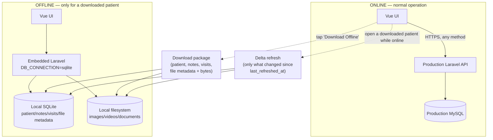

# Medical Plus v4 — Target Architecture (Design Doc)

Companion to [`ARCHITECTURE_ANALYSIS.md`](ARCHITECTURE_ANALYSIS.md), which documents the *current* system. This document is prescriptive: it describes the architecture to build toward and the concrete changes required to get there. No application or native code has been modified to produce this document — every claim about current behavior carries a file reference back to the analysis or to source read while writing this doc.

---

## 1. Why this change

Today, the on-device NativePHP instance is a full second Laravel+SQLite application that every normal operation flows through first (`ARCHITECTURE_ANALYSIS.md` §2, §4). A write lands in local SQLite as `sync_status=pending_create`, and a separate background engine (`SyncEngineService`) pushes it to production later, on login or on manual "Sync Now" only — nothing triggers automatically on reconnect (`ARCHITECTURE_ANALYSIS.md` §9). This is real offline-first architecture, and it is the direct cause of several standing defects: the `Patient XXXXX` stub-patient bug, unresolved sync conflicts, and sync runs that silently never complete (`ARCHITECTURE_ANALYSIS.md` §13).

The target is narrower and simpler: **local storage is not a second database.** It is a deliberately-triggered, read-only snapshot of one patient, for viewing when there is no connection. Everything else — every list, create, edit, note, visit, upload, delete — talks to production directly, the same way any ordinary online app would.

---

## 2. Target architecture



Two rules govern everything below:

1. **Online → production, always, for every method.** No exceptions for POST/PUT/DELETE. Local SQLite is never written to as a side effect of a normal online action.
2. **Local SQLite exists only inside a downloaded package.** A row there is a *copy* of a production row, not an independent entity. It carries no `sync_status`, no `pending_*` state, and there is no path that pushes a local edit back to the server — because there is no local edit. Offline is view-only.

---

## 3. Kotlin / Android layer changes

The routing decision that currently blocks rule 1 lives entirely in one file: `nativephp/android/app/src/main/java/com/nativephp/mobile/network/RequestRouter.kt`. This file is already mid-migration toward the target — its own header calls it "Phase 7 Offline Architecture" — which is why the fix is a small, surgical edit rather than a new subsystem.

### 3.1 Current rules (`RequestRouter.kt:25-33`, logic at `:100-135`)

| Rule | Condition | Target today |
|---|---|---|
| 3 | internal route + GET + ONLINE | `EXTERNAL` (production) — **already correct** |
| 4 | internal route + POST/PUT/DELETE + ONLINE | `LOCAL_PHP` (embedded Laravel) — **this is the piece to cut** |
| 5 | internal route + OFFLINE | `LOCAL_PHP` — stays, but see §4.1 for what Laravel must do differently on this path |
| 2 | any `/_native/*` path | always `LOCAL_PHP` — **unchanged, and exactly where the new offline-package endpoints belong** |

### 3.2 Required change

Collapse rules 3 and 4: **internal route + ONLINE → `EXTERNAL`, regardless of method.** Concretely, in `route()` (`RequestRouter.kt:121-135`), delete the `isApiMutation` special case (`:114-119`, `:122-125`) so the branch becomes:

```kotlin
if (UrlNormalizer.isInternalRoute(path)) {
    return if (isOnline) {
        RouteTarget.EXTERNAL   // production — every method
    } else {
        RouteTarget.LOCAL_PHP  // offline fallback, see §4.1
    }
}
```

No change is needed to rule 2 (`_native/*` always local) or to `UrlNormalizer`/`NetworkStateManager` routing inputs — the new offline-package feature (§5) is deliberately placed under `_native/api/offline-package/*` so it inherits "always local" for free, in both online and offline states (a package download/refresh always writes to local SQLite regardless of connectivity, by definition).

### 3.3 Reliable connectivity signal for Vue

`NetworkStateManager.kt` already tracks real device connectivity via `ConnectivityManager` callbacks (`:56-80`) — this is authoritative, unlike `navigator.onLine`, which `resources/js/**` already has comments (`useOfflineUploads.js`, `AddRecordModal.vue`) flagging as unreliable inside this WebView. Today this state is consumed only by `RequestRouter`; it is never exposed to JS.

Add a `@JavascriptInterface` method on the existing `JSBridge` class (`WebViewManager.kt:814+`), e.g. `fun isOnline(): Boolean = NetworkStateManager.getInstance(context).isOnline()`, registered under the existing `addJavascriptInterface(..., "AndroidPOST")` call (`WebViewManager.kt:791`) or a new dedicated interface name. Vue then reads `window.AndroidPOST?.isOnline?.()` with a fallback to `navigator.onLine` for the plain-web build (no NativePHP). This becomes the single source of truth the frontend uses to disable write UI and show the offline banner — see §6.

---

## 4. Backend (Laravel) changes

### 4.1 Stop treating the sqlite connection as a write target

`Api\Mobile\{Patient,Note,Visit,File}Controller` currently branch on `config('database.default') === 'sqlite'` to decide between `sync_status = pending_*` (device) and `synced` (production) (`ARCHITECTURE_ANALYSIS.md` §4, §6). After §3's routing change, this branch is **only ever reached when the device is offline** (online writes never hit local Laravel anymore). Replace the pending-write branch with an explicit rejection:

- Any create/update/delete on `/api/v1/mobile/*` (or `/api/v1/*` web-mutation equivalents) reaching the sqlite connection returns a clear `503` (or `409`) with a body like `{"error": "offline", "message": "This action requires an internet connection."}`. Do not write a stub or pending row.
- The one exception: reads scoped to an already-downloaded package (`GET /_native/api/workspace/{uuid}`, `WorkspaceController::patientData`, `routes/web.php:542`) continue to work exactly as today — that endpoint already reads local SQLite directly and is unaffected.

This removes the code path that fabricates `'Patient ' . $uuid` stub rows (`ChunkUploadController::resolvePatient()`, `:459-509` per `ARCHITECTURE_ANALYSIS.md` §5) — that path only exists to paper over an offline file upload referencing a not-yet-synced patient, a situation that can't occur once offline writes aren't supported at all.

### 4.2 New offline-package endpoints

New route group `_native/api/offline-package/*` (replaces the old `_native/api/offline/*` prefix used for pending uploads/notes, which is removed — see §7):

| Endpoint | Purpose |
|---|---|
| `POST /_native/api/offline-package/{patientUuid}` | Download: pull patient + notes + visits + file metadata from production via the existing `RemoteApiService` auth/base-URL pattern (`app/Services/Mobile/RemoteApiService.php`), upsert into local SQLite, then fetch file bytes into local filesystem. |
| `POST /_native/api/offline-package/{patientUuid}/refresh` | Delta refresh: only pull what changed since `offline_packages.last_refreshed_at` — reuses the "eligible/recently-changed" filtering already implemented in `app/Services/Sync/DownloadSyncService.php:326-409`, scoped to a single patient instead of walked globally. |
| `GET /_native/api/offline-package` | List downloaded packages (for a "Downloaded Patients" / storage-management screen). |
| `DELETE /_native/api/offline-package/{patientUuid}` | Remove a package: delete local rows + files. `FileCacheRepository::removePatient()` (already exists) is the reusable primitive for the file-deletion half. |

New minimal table `offline_packages` (`patient_uuid`, `downloaded_at`, `last_refreshed_at`) — this is the *only* new sync-adjacent metadata needed. The `patients`/`patient_notes`/`patient_visits`/`patient_files` rows in SQLite already have the right shape to hold the package payload verbatim (same migrations as production per `config/database.php:35`); they just stop carrying sync semantics.

New service, e.g. `app/Services/Offline/OfflinePackageService.php`, built by narrowing two existing services rather than writing from scratch:
- Download/refresh logic: adapt `DownloadSyncService`'s per-patient pull methods (`downloadPatients`, notes/visits pull at `:326-409`, file-metadata pull at `:414-483`) to take a single `patientUuid` instead of walking all patients.
- File bytes: adapt `FileCacheService`/`FileCacheRepository` — today a global 500MB LRU cache that can evict any patient's files to make room for another (`ARCHITECTURE_ANALYSIS.md` §12, cache-quota research). Under the target model, a downloaded package must **never** be silently evicted by unrelated activity — either give package files a distinct on-disk location outside the LRU cache's quota accounting, or exclude `offline_packages`-tracked files from `ensureQuota()`'s eviction candidates entirely.

### 4.3 Removal list (later cleanup phase, not bundled with cutover)

Once §3+§4.1+§4.2 are live and verified, remove:

- Services: `app/Services/SyncEngineService.php`, `app/Services/ManualSyncService.php`, `app/Services/OfflineUploadService.php`, `app/Services/Sync/{PatientSyncService,FileSyncService,NoteSyncService,VisitSyncService,CategorySyncService,ConflictResolverService,CacheCleanupService}.php`, `app/Domains/Sync/Services/SyncQueueService.php`.
- Routes: the `_native/api/sync/*` group (`routes/web.php:550+`), the old `_native/api/offline/{uploads,notes}` group (`routes/web.php:317-340`, superseded by §4.2), `/_native/api/patients/pending` (`routes/web.php:354-363`), `/_native/api/patients/{uuid}/categories/{slug}/local-files` (`routes/web.php:444-478`) — all exist only to reconcile pending-write state that no longer exists.
- Tables (via migration, after confirming zero remaining references): `sync_queue`, `offline_files`, plus the already-dead `pending_operations`, `sync_meta`, `sync_states`, `sync_jobs` (`ARCHITECTURE_ANALYSIS.md` §8, §14.9).
- Columns: `sync_status`, `version`, `server_updated_at`, `client_updated_at`, `remote_uuid` on `patients`/`patient_notes`/`patient_visits`/`patient_files` — audit call sites first; some UUID-handling code (e.g. patient idempotency-by-uuid on create) is independent of sync status and must be kept.
- Frontend composables/components: see §6.

Do this as its own PR, separate from the cutover, so each phase stays revertible independently.

---

## 5. Frontend (Vue) changes

- `resources/js/Utils/api.js` — **no change needed.** Its relative-URL-only design (`:24-105`) already exists specifically so the Kotlin router can intercept and redirect; that mechanism is exactly what §3 relies on.
- `useWorkspace.js addPatient()` (`:511-543`) and equivalents for notes/visits/files — drop the "local-first, 5ms response, background sync" framing documented in the existing comment block. After §3, the same `axios.post('/api/v1/workspace/patients', ...)` call is a normal single round trip to production; show a loading state and handle the response/error like any ordinary online form submit. No behavioral change is needed in *how* the request is issued — only in what callers should now expect (a real network round trip, including real network errors).
- Remove: `useSyncEngine.js`, `useOfflineUploads.js`, `SyncCenterModal.vue`, and the `sync_status`-driven "pending" badges/icons in `PatientListSidebar.vue` and similar list views.
- Add: `useOfflinePackages.js` — wraps the §4.2 endpoints (download/refresh/list/delete), and a "Download Offline" affordance on the patient view (e.g. in `PatientSummary.vue`) plus a downloaded-patients management surface (reasonable home: `SettingsModal.vue`, replacing the old sync center).
- Connectivity: replace `navigator.onLine` usage with the new bridge (§3.3), falling back to `navigator.onLine` only on non-native web builds. Use it to (a) disable create/edit/upload controls and show a persistent offline banner when offline and no package is open, and (b) scope the offline patient list to `GET /_native/api/offline-package` results only.

---

## 6. What "offline" looks like to the user, precisely

- **Online, any patient**: full read/write, always against production. No SQLite involved.
- **Online, opening a patient that has a downloaded package**: normal online read from production (unchanged), plus a fire-and-forget call to `POST /_native/api/offline-package/{uuid}/refresh` so the local copy stays current for the next time the device goes offline. This must not block the UI — the production data is already the one being shown.
- **Offline, a downloaded patient**: served from local SQLite/filesystem via the existing `_native/api/workspace/{uuid}` read path — view-only, no edit/note/visit/upload controls enabled.
- **Offline, any other patient (not downloaded)**: not available. Clear messaging, not a blank list or a silent failure.
- **Offline, attempting a write**: blocked client-side by the connectivity signal before the request is even made; if one slips through anyway (race condition), the backend rejection in §4.1 is the backstop, not the primary UX.

---

## 7. Explicitly flagged risks / decisions (not silently assumed)

1. **Auth token not cleared on logout** (`ARCHITECTURE_ANALYSIS.md` §10, §13.3) — worth fixing in the same effort, because once local package data is real, per-user data isolation matters: local SQLite currently has no per-doctor scoping at all (§14.4), and a shared device could otherwise show one doctor's downloaded patient to the next doctor who logs in. Recommend: clear `offline_packages` (and their local rows/files) on logout, in addition to fixing the `localStorage` token leak.
2. **Mid-request connectivity loss** — under the new model there is no local fallback to catch a write that fails partway through a request. This must surface as a normal error to the user (retry / lost, like any online app), not silently queue anything. Explicitly worth deciding whether any client-side retry-once-on-network-error behavior is wanted, since there is no server-side idempotency net for a partially-applied multi-step write (e.g., patient created, note attach failed).
3. **File cache LRU vs. package permanence** (§4.2) — needs an explicit choice: separate storage bucket for packages vs. quota-exempting package files inside the existing cache. Left as an open decision for the implementing PR, not resolved here.
4. **Two chunked-upload code paths** (`ChunkUploadController` vs. `FileController@store`, `ARCHITECTURE_ANALYSIS.md` §15) — should be resolved (pick one canonical path) as part of §4.1's rewrite of the mobile controllers, since both currently have sqlite-branch logic that needs the same treatment.
5. **Schema migration risk** — `patients`/`patient_files`/`patient_notes`/`patient_visits` migrations run against both `mysql` and `sqlite` from the same migration set (`config/database.php:35`). Dropping the `sync_status`/`pending_*`/`version` columns (§4.3) must account for SQLite's limited `ALTER TABLE` support — verify the drop migration actually runs cleanly on-device, not just against MySQL in CI.

---

## 8. Phased delivery plan

Each phase should be its own PR and independently revertible.

1. **Kotlin router cutover** (§3.1–3.2) + JS connectivity bridge (§3.3). Verify: with the app online, watch device logs (`RequestRouter`'s own `Log.d` at `:159-171`) confirm every method now logs `EXTERNAL` for internal routes; confirm a patient create/edit/upload while online actually appears in production MySQL immediately, with no local SQLite row created.
2. **Backend reject-offline-writes** (§4.1). Verify: force the device offline (airplane mode), attempt a create/edit — confirm a clean rejection response instead of a `pending_create` row appearing locally.
3. **Offline-package feature**, backend + frontend together (§4.2, §5, §6). Verify end-to-end: download a patient online, go offline, open it (read-only, all data present including files), come back online, confirm a background refresh occurs and picks up a change made from another session.
4. **Dead-code and dead-table removal** (§4.3, §5's removal list). Verify: full grep for removed symbols returns nothing; app boots and all phase 1–3 flows still pass.
5. **Schema cleanup migration** (§7.5) — drop now-unused columns, run against a copy of a real on-device SQLite file before shipping, not only against MySQL.
